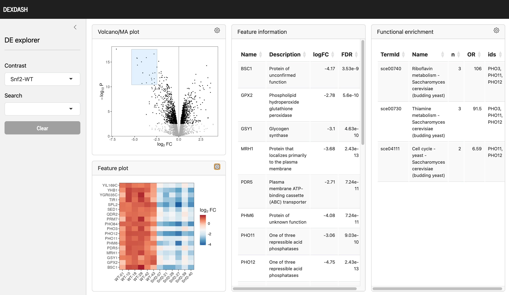

```{r options, include = FALSE}
knitr::opts_chunk$set(
  collapse = TRUE,
  comment = "#>"
)
```

```{r setup, include = FALSE}
options(width = 72)
library(tibble)
library(dplyr)
library(tidyr)
library(purrr)
library(forcats)
library(stringr)
library(edgeR)
```

```{r dexdash}
library(dexdash)
```

## Overview

Imagine you've carried out an RNA-seq experiment, a proteomics study, or maybe another type of -omics research. You've done read mapping or protein quantifications and now have a set of data in hand. This data captures expression or abundance (we will call it 'expression' for simplicity) for each gene, protein, or other entity (hereinafter referred to as 'feature'). These expressions are recorded across various biological conditions (which we'll call 'groups') and their replicates. Following this, you've conducted a differential expression analysis using tools like *limma*, *edgeR*, *DESeq2*, or similar, ending up with a data frame that includes log-fold change, p-value, among other metrics.

Now, you're ready to investigate the results. You want to generate a volcano or MA plot, quickly identify features of interest, and explore the functional similarities among groups of features that behave similarly. This is exactly what *dexdash* is for. Simply feed it your expression data, differential expression results, and some details about your experimental design and gene names, and voila! You're equipped with a web-based interactive tool to explore your data.


```{r figure, fig.cap="Screenshot of dexdash Shiny app.", echo=FALSE, out.width="100%"}

```

## Installation

*dexdash* can be installed from *GitHub* by using:

```{r bioconductor_install, eval = FALSE}
if (!require("remotes", quietly = TRUE))
  install.packages("remotes")

remotes::install_github("bartongroup/dexdash")
```

## Quick example

```{r quick_example, eval = FALSE}
library(dexdash)

# Data examples available in the package
data(yeast_de, yeast_data, yeast_metadata, yeast_features)
# The slow bit: download functional term data
yeast_terms <- download_functional_terms("yeast")
yeast_fterms <- prepare_functional_terms(terms, feature_name = "gene_id")
# The fast bit: interactive app
run_app(yeast_de, yeast_data, yeast_metadata, yeast_features, yeast_fterms)
```

## Usage

```{r prepare_table, echo = FALSE}
args_de <- tibble::tribble(
  ~column, ~type, ~description,
  "id", "character", "feature identifier",
  "log_fc", "numeric", "log-fold change; use <span style='font-family: monospace'>logFC</span> from *edgeR* and *limma*, <span style='font-family: monospace'>log2FoldChange</span> from *DESeq2*",
  "expr", "numeric",  "mean expression or abundance, typically in logarithmic scale; use <span style='font-family: monospace'>logCPM</span> from *edgeR*, <span style='font-family: monospace'>log10(baseMean)</span> from *DESeq2*, <span style='font-family: monospace'>AveExpr</span> from *limma*",
  "p_value", "numeric", "p-value from statistical tests; use <span style='font-family: monospace'>PValue</span> from *edgeR* and *limma*, <span style='font-family: monospace'>pvalue</span> from *DESeq2*",
  "contrast", "factor", "name of the contrast; this data frame can contain results from multiple contrast"
) |> 
  tibble::add_column(argument = c("de", "", "", "", ""), .before = 1)

args_data <- tibble::tribble(
  ~column, ~type, ~description,
  "id", "character", "feature identifier",
  "sample", "character", "sample identifer",
  "value", "numeric", "the expression, or abundance of the gene/protein for this sample"
) |> 
  tibble::add_column(argument = c("data", "", ""), .before = 1)

args_metadata <- tibble::tribble(
  ~column, ~type, ~description,
  "sample", "character", "sample identifer",
  "group",  "character/factor", "a grouping variable, for example condition or treatment"
) |> 
  tibble::add_column(argument = c("metadata", ""), .before = 1)

args_features <- tibble::tribble(
  ~column, ~type, ~description,
  "id", "character", "feature identifier",
  "name", "character", "a human-readable name of the feature, typically a gene symbol",
  "decription", "character", "a brief description of the feature"
) |> 
  tibble::add_column(argument = c("features", "", ""), .before = 1)

all_args <- bind_rows(args_de, args_data, args_metadata, args_features)
```

The *dexdash* Shiny app is launched with a command:

```{r usage, eval = FALSE}
run_app(de, data, metadata, features, fterms)
```

There are five mandatory arguments:

  - `de` - data frame with differential expression results,
  - `data` - data frame with expression or abundance data,
  - `metadata` - data frame with the design of the experiment,
  - `features` - data frame with feature names and descriptions,
  - `fterms` - an object containing functional terms data.


### Data frames

The table below summarises columns required in the four data frames. These data frames must be created by the user. Differential expression output differs from tool to tool, here we show which columns to use from the output of *edgeR*, *DESeq2* and *limma*. A full worked example below demonstrates how to prepare the required data, step by step.

```{r data_columns, echo = FALSE}
knitr::kable(all_args)
```

### Functional term data

To perform fast interactive functional enrichment, *dexdash* requires data downloaded from on-line databases and prepared for fast enrichment. This can be achieved with the following functions:

```{r yeast_terms, include = FALSE}
data(yeast_fterms)
```

```{r download_terms, eval = FALSE}
yeast_terms <- download_functional_terms(species = "yeast")
yeast_fterms <- prepare_functional_terms(terms, feature_name = "gene_id")
```

The first argument in this function is a species name. Based on this name, the function will download the relevant data from the online databases. The GO, KEGG and Reactome databases use different species designation names. For example, designation for yeast is "sgd", "Saccharomyces cerevisiae" and "sce", for GO, Reactome and KEGG, respectively. In oder to interrogate these databases, the correct designations must be passed on. This package contains a small JSON file, which can be accessed:

```{r species_file}
species_file <- system.file("extdata", "species.json", package = "dexdash")
```

It contains designation information for a few species. If your species is not included, you need to create a JSON file in the same format, as the included file, and provide its location by argument `species_file` in the `download_functional_terms()` function.

Here is the entry for yeast:

```{r species_json, echo = FALSE}
jsonlite::read_json(species_file) |> 
  purrr::pluck("yeast") |> 
  jsonlite::toJSON(pretty = TRUE, auto_unbox = TRUE)
```

The species designations can be found using `fenr::fetch_go_species()`, `fenr::fetch_reactome_species()` and `fenr::fetch_kegg_species()`. These three functions return data frames, where column `designation` contains the species designation required.

The second argument, `feature_name`, specifies the name of the column in the `mapping` tibble to be used as the feature identifier. See the [vignette](https://bioconductor.org/packages/release/bioc/vignettes/fenr/inst/doc/fenr.html) of `fenr` package for more details. `feature_name` can be either `"gene_symbol"` or `"gene_id"`. If
your data contain gene symbols (e.g. `"BRCA1"` or `"FOXP1"`), use `feature_name = "gene_symbol"`. If your data contain Ensembl identifiers (e.g. `"ENSG00000012048"` or  `"ENSG00000114861"`), use `feature_name = "gene_id"`.


## Simple example

### Count data

We start with the count data from an RNA-seq experiment. Let's call it `yeast_mtx`. It is a matrix with rows corresponding to genes and columns corresponding to samples. It contains the same data as the `yeast_data` object, but in wide, matrix format.

```{r yeast_count_matrix}
data(yeast_mtx)
dim(yeast_mtx)
head(yeast_mtx)
```

### Metadata

First, we create a metadata data frame with grouping information. We extract group designation (WT or Snf2) form sample names and convert them into factors, with the first level `WT`. As per *dexdash* requirements, the column names of this data frame are `sample` and `group`:

```{r yeast_metadata}
library(tibble)
library(dplyr)
library(tidyr)
library(forcats)

yeast_metadata <- tibble(sample = colnames(yeast_mtx)) |> 
  mutate(group = str_extract(sample, "^.+(?=-)")) |> 
  mutate(group = fct_relevel(group, "WT"))

yeast_metadata
```

### Differential expression

Next, we carry out differential expression using *edgeR*. This is a simple case of two conditions (groups), each in six replicates. Again, we need specific column names for *dexdash*. If you use a different differential expression tool, the default column names would be different. In any case, they need to be `id`, `log_fc`, `expr`, `p_value`, and `contrast`. Whichever DE tool you use, make sure to rename the columns before passing the result to `dexdash`.

```{r yeast_differential_expression}
library(edgeR)
library(purrr)

design_mat <- model.matrix(~group, yeast_metadata)
yeast_de <- yeast_mtx |> 
  DGEList() |>
  calcNormFactors() |>
  estimateDisp(design = design_mat) |>
  glmQLFit(design = design_mat) |>
  glmQLFTest(coef = "groupSnf2") |>
  topTags(n = 1e16, sort.by = "none") |>
  pluck("table") |>
  as_tibble(rownames = "id") |>
  add_column(contrast = "Snf2-WT") |> 
  rename(
    log_fc = logFC,
    expr = logCPM,
    p_value = PValue
  )

yeast_de
```

### Count data in long format

`dexdash` requires count data in long format, with column names `id`, `sample` and `value`. We create the appropriate data frame:

```{r yeast_long_format}
yeast_data <- yeast_mtx |> 
  as_tibble(rownames = "id") |> 
  pivot_longer(-id, names_to = "sample", values_to = "value")

yeast_data
```

### Feature names and descriptions

Next, we need a table convertinggene identifiers into human-readable gene names and descriptions. This can be done with the helper function `download_feature_information()`:

```{r load_yeast_features}
data(yeast_features)
```


```{r yeast_features, eval = FALSE}
yeast_features <- download_feature_information(species = "yeast")
```

```{r show_yeast_features}
yeast_features |> arrange(name)
```


### Functional enrichment data

Finally, as indicated earlier, we need the functional enrichment data. This is done in two steps:

```{r yeast_download_terms_2, eval = FALSE}
yeast_terms <- download_functional_terms("yeast")
yeast_fterms <- prepare_functional_terms(yeast_terms, feature_name = "gene_id")
```

### Run dexdash

Now, we have all necessary data to launch `dexdash`:

```{r yeast_run_app, eval = FALSE}
run_app(yeast_de, yeast_data, yeast_metadata, yeast_features, yeast_fterms)
```

## Advanced example

### Messing with identifiers

Struggling with identifiers is all in a day's work of a bioinformatician. Alas, there are no unified gene of protein identifiers in this imperfect word, and getting data from various sources inevitable leads to inconsistencies. Below, we show an example of a typical *dexdash* workflow, which requires a little bit more effort.

Consider a count matrix from a mouse RNA-seq experiment (originally from [Blümli et al. (2021)](https://www.sciencedirect.com/science/article/pii/S2211124721014169?via%3Dihub), here we use only three time points and KO):

```{r mouse_matrix}
data(mouse_mtx)
head(mouse_mtx)
```

Genes are identified by Ensemble gene IDs. Let us have a look at the mouse functional term information, downloaded from GO, Reactome and KEGG. First, we download terms and mappings:


```{r load_mouse_terms, include = FALSE}
data(mouse_terms)
```

```{r mouse_terms, eval = FALSE}
mouse_terms <- download_functional_terms(species = "mouse")
```

Now, we look at a random selection of rows in feature-to-term mapping tables:

```{r mouse_mappings}
set.seed(42)
mouse_terms$go$mapping |> sample_n(10)
mouse_terms$reactome$mapping |> sample_n(10)
mouse_terms$kegg$mapping |> sample_n(10)
```

We have a problem. Our data uses Ensembl IDs, but out of the three databases, only Reactome provides with Ensembl IDs. GO returns gene aliases and KEGG uses NCBI IDs. We need put all these data together. The only unifying identifier is the gene symbol, returned by all three databases. To make it consistent with our data, we need to convert Ensembl IDs into gene symbols. For this, we use the function `download_feature_information()`:


```{r load_mouse_genes, include = FALSE}
data(mouse_genes)
```

```{r mouse_gnenes, eval = FALSE}
mouse_genes <- download_feature_information(species = "mouse")
```

```{r show_mouse_genes}
mouse_genes
```

It returns a data frame linking Ensembl IDs and gene symbols. It also provides with gene descriptions, which we are going to need later. From this data frame we create a new one:

```{r mouse_id2symbol}
id2symbol <- tibble(
  rowname = rownames(mouse_mtx),
  id = rowname |> 
     str_remove("\\.\\d+$")
) |> 
  inner_join(mouse_genes, by = "id") |> 
  mutate(gene_id = toupper(name))

id2symbol
```

It contains the exact rowname from the count table, the extracted Ensembl ID, without the version number (e.g. `.1`), which is joined with our gene data frame. In addition, we converted gene symbols into upper case (column `gene_id`). This is another issue - different sources provide gene symbols in different capitalisation. Sometimes, the first letter in in capitals, sometimes the entire gene symbol is capitalised. To circumvent this issue our function `download_feature_information()` automatically capitalises all gene symbols, hence, we need to do the same in the `id2symbol` structure.

Having prepared all of this, we can rename rows in the count table:

```{r rename_mtx_rows}
renamed_mtx <- mouse_mtx[id2symbol$rowname, ]
rownames(renamed_mtx) <- id2symbol$gene_id

head(renamed_mtx)
```

Now, we have consistent identifers in count data and functional enrichment data. We can proceed.

### Metadata

Like before, we create a metadata data frame with experiment grouping:

```{r mouse_metadata}
mouse_metadata <- tibble(sample = colnames(renamed_mtx)) |> 
  mutate(group = str_extract(sample, "^.+(?=-)")) |> 
  mutate(group = fct_relevel(group, c("0h", "2h", "18h")))

mouse_metadata
```

### Differential expression

Differential expression if carried out with *edgeR*, like for the yeast data, but this time we have more than one contrast. We select timepoint `0h` as the baseline and find contrasts between this and other time points.

```{r mouse_differential_expression}
library(edgeR)
library(purrr)

design_mat <- model.matrix(~group, mouse_metadata)
coefficients <- colnames(design_mat)[-1]
fit <- renamed_mtx |> 
  DGEList() |>
  calcNormFactors() |>
  estimateDisp(design = design_mat) |>
  glmQLFit(design = design_mat)

mouse_de <- map(coefficients, function(coef) {
  fit |> 
    glmQLFTest(coef = coef) |> 
    topTags(n = 1e16, sort.by = "none") |>
    pluck("table") |>
    as_tibble(rownames = "id") |>
    add_column(contrast = coef)
}) |> 
  list_rbind() |> 
  rename(
    log_fc = logFC,
    expr = logCPM,
    p_value = PValue
  )

mouse_de
```

### Count data in long format

We need data in long format:

```{r mouse_long_format}
mouse_data <- renamed_mtx |> 
  as_tibble(rownames = "id") |> 
  pivot_longer(-id, names_to = "sample", values_to = "value")

mouse_data
```

### Feature names and descriptions

For the Shiny app, a feature information table is needed to link feature identifiers (capitalised gene symbols), feature names (original gene symbols) and descriptions:

```{r new_mouse_features}
mouse_features <- mouse_genes |> 
  mutate(id = toupper(name))

mouse_features
```

### Functional enrichment data

Finally, we need to prepare functional enrichment data in the fast enrichment format:

```{r mouse_prepare_terms}
mouse_fterms <- prepare_functional_terms(mouse_terms, feature_name = "gene_symbol")
```

### Run dexdash

Now, we have all necessary data to launch `dexdash`:

```{r mouse_run_app, eval = FALSE}
run_app(mouse_de, mouse_data, mouse_metadata, mouse_features, mouse_fterms)
```


## Comparison with other tools

### iDEP

*[iDEP](http://bioinformatics.sdstate.edu/idep/)* is a flexible web-based tool that supports full data analysis, starting from the count matrix. It includes pre-processing, clustering, PCA, differential expression, KEGG pathway analysis and more. While it generates volcano and MA plots, they lack fast interactivity. In particular, pathway analysis in *iDEP* if only performed on down- or up-regulated genes. In contrast, *dexdash* is smaller and more focussed on interactivity, visualisation and fast functional enrichment on any arbitrary gene selection. Additionally, *dexdash* suports GO and Reactome functional terms, alongside with KEGG.

### ShinyGO

*[ShinyGO](http://bioinformatics.sdstate.edu/go/)* is a web-base Shiny app for comprehensive KEGG pathway enrichment analysis. Users can submit a list of gene names for analysis, which then provides various outputs. In contrast, *dexdash* works on differential expression result set and creates interactive volcano/MA plots for fast repeated gene selection and simple GO, KEGG and Reactome enrichment analysis.

### Glimma

*[Glimma](https://bioconductor.org/packages/release/bioc/html/Glimma.html)* is a Bioconductor R package designed to create interactive MDS, MA and volcano plots. Users can explore gene expression patterns by selecting individual genes. By contrast, *dexdash* allows for multiple gene selection, functional enrichment analysis and reverse selection of functional terms to find functionally related genes. 


### Other packages

*[VolcaNoseR](https://huygens.science.uva.nl/VolcaNoseR/)* is a simple customisable volcano plot with no additional functionality. *clusterProfiler*, *ReactomePA*, *GOplot* and *topGO* provide robust tools for enrichment analysis but do not offer the interactive, user-driven experience found in *dexdash*.

## Session info {.unnumbered}

```{r session_info, echo = FALSE}
sessionInfo()
```
